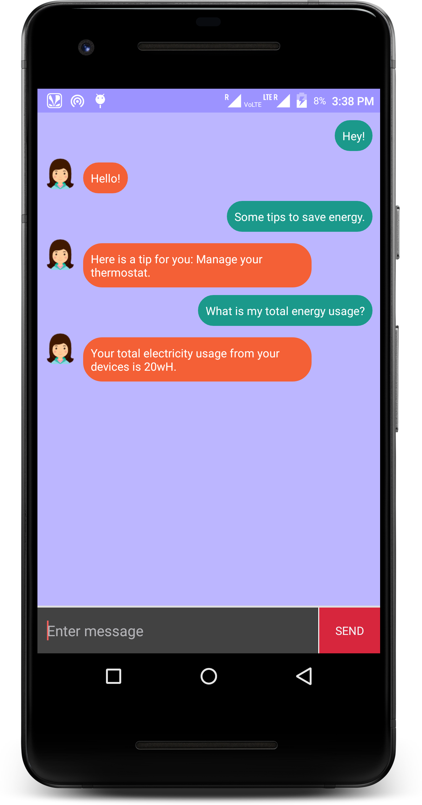

# Urja
This repository contains the android companion app for a smart electric meter. Urja is a smart electric meter for household purposes. It will do the basics of recording the current usage but even provide various kinds of insights into the usage of this electricity as well as a companion chatbot to have an easy one-touch solution to any kind of queries related to the meter/consumption.

# Competition
HackerTech'18

# Screenshots

</img>

</img> 
</img>
</img>
